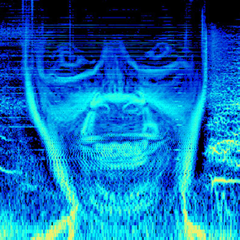
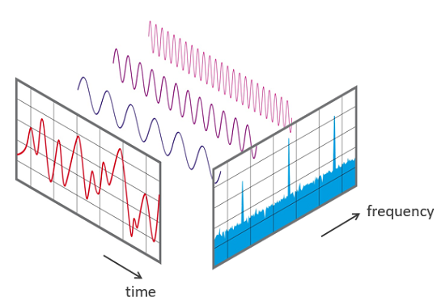

# img2spect - Storing images in the frequency domain



[Aphex Twin](https://en.wikipedia.org/wiki/Aphex_Twin)'s 1999 album [Windowlicker](https://en.wikipedia.org/wiki/Windowlicker) contains several hidden images within the frequency domain.  These images are visible within the spectrograms of each track.  Above is a self portrait of the artist that is stored on this album!



Every signal has both a time and frequency component.  The relationship between these domains is illustrated above.  Here, we take an image and store its luminance values within the frequency domain of an audio signal.  This script utilizes a [Fourier transform](https://en.wikipedia.org/wiki/Fourier_transform) to encode the luminance values of a user-provided image file and outputs it as a WAV file in a similar method to the one employed by the aforementioned electronic artist.


Example images, their resultant WAV files, and spectrograms of those WAV files are provided in the *test-images* directory.  Above is an example spectrogram of an image encoded using this script.  The level of detail that can be stored within the frequency domain of audio is quite astonishing!

## Dependencies

  * [Pillow](https://pillow.readthedocs.io/en/stable/)
  * [scipy](https://www.scipy.org/)
  * [numpy](http://www.numpy.org/)

You can use [pip](https://pypi.python.org/pypi/pip) to install any missing dependencies.

## Encoding Images

This code takes a user supplied image, converts it to grayscale, and stores it in the frequency domain of an audio signal.  The script is executed by running:

```
python img2spect.py name-of-image-file.png
```

Example WAV files as well as source images and spectrograms are available in the *test-images* directory.

## Acknowledgements

This project was inspired by [Aphex Twin](https://aphextwin.warp.net/)'s creative audio-visual steganography.
